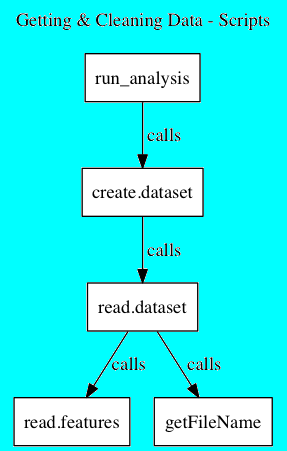

# GCD_TidyData
## Coursera, JHU, Getting and Cleaning Data - Course Project
  
  
</img>

#### R Scripts for this Project
  
Script | Description | Calls
------ | ----------- | -----
run_analysis.R | This is the top-level R script to perform the analysis for this project. Creates a merged data frame containing all the relevant data. Groups the data by subject and activity.  Calculates the mean of the grouped data.  Writes the summarized data to a file.| create.dataset.R 
create.dataset.R | Reads the feature list, and determines the subset indices for the mean and std variables.  Reads and combines the test and training data frames. | read.dataset.R
read.dataset.R | Reads a particular 'type' of data set (test or training) into a data frame.  Combines the accelerometer, subject, and activity data into a single data frame. | read.features.R, getFileName
read.features.R | Reads the accelerometer data, line by line.  Subsets by the mean and std variable names, and stores the results in a data frame. |  

#### List of Files for this Project  

File Name | Purpose
--------- | -------
README.md | How all of the scripts work, and how they are connected.
ASSIGNMENT.md | Description of this assignment, and the requirements for this project.
CodeBook.md | Describes the variables, the data, and any transformations or work performed to clean up the data.
run_analysis.R | Top-level R script to perform the analysis.
create.dataset.R | Read and combine the test and training data frames.
read.dataset.R | Create a data frame from the accelerometer data, with the subject and activity data.
read.features.R | Read the accelerometer data, line by line.  Extract the mean and std columns into a data frame.
tidydata.txt | *Tidy data* set that is the result of this analysis (Step 5).
